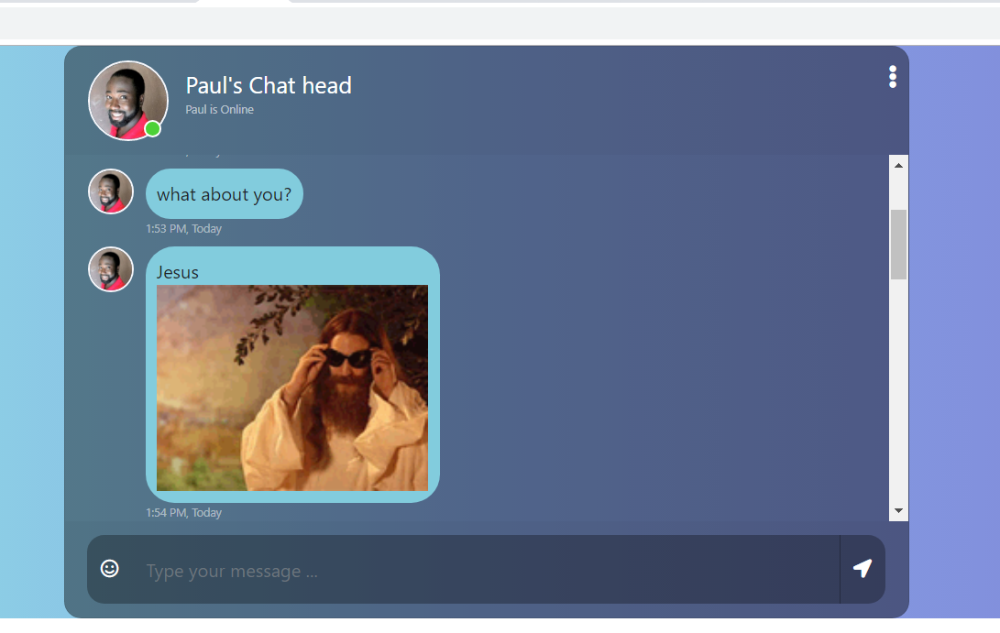

## Using the Giphy API

## Task

* Using the Giphy API https://developers.giphy.com/docs/ - Write a chat input that takes a command, converts the ensuing string into a gif (Like in Slack) and adds it to the conversation

## To Run

* [Download the installer](https://nodejs.org/) for Node.js 6 or greater.
* Install the angular CLI globally: `npm install -g angular@latest`
* Clone this repository: `https://github.com/paulappz/frontend-test-II.git`.
* Run `npm install` from the project root.
* Run `ng serve -o` in a terminal from the project root.

## App Preview
  

## File Structure of App

```
ionic-conference-app/
├-- .github/                            * GitHub files
│   ├── CONTRIBUTING.md                 * Documentation on contributing to this repo
│   └── ISSUE_TEMPLATE.md               * Template used to populate issues in this repo
|
|-- e2e/
|    |--scr/
|    |    ├── app.e2e-spec.ts
|    |    └── app.po.ts
|    |-- protractor.conf.js
|    |-- tsconfig.e2e.json
|-- src/
|    |-- app/
|    |    ├── app.component.css
|    |    └── app.component.html
|    |    └── app.component.spec.ts
|    |    └── app.component.ts
|    |    └── app.module.ts
|    |    └──service/
|    |          ├──giphy.service.spec.ts
|    |          └── giphy.service.ts
|    |    
│    ├── assets/.gitkeep                     * ---
│    ├── environments/                       * env folder
|    |     ├── environment.prod.ts           * env production file
|    |     ├── environment.ts                * env non production file

Type	Name	Latest commit message	Commit time
..		
	getting started @paulappz	13 hours ago
environment.ts

|    |
|    |-- browserslist
|    |-- favicon.ico
|    |-- index.html
|    |-- karma.conf.js
|    |-- main.ts
|    |-- polyfills.ts
|    |-- styles.css
|    |-- test.ts
|    |-- tsconfig.app.json
|    |-- tsconfig.spec.json
|    |-- tslint.json
|    |
|    |
|    |
├── .editorconfig                       * Defines coding styles between editors
├── .gitignore                          * Example git ignore file
├── README.md                           * This file
├── angular.json                        * Angular configuration file
├── package-lock.json.                  * Defines our JavaScript dependencies
├── package.json                        * Defines our JavaScript dependencies
├── tsconfig.json                       * Defines the root files and the compiler options
├── tslint.json                         * Defines the rules for the TypeScript linter

